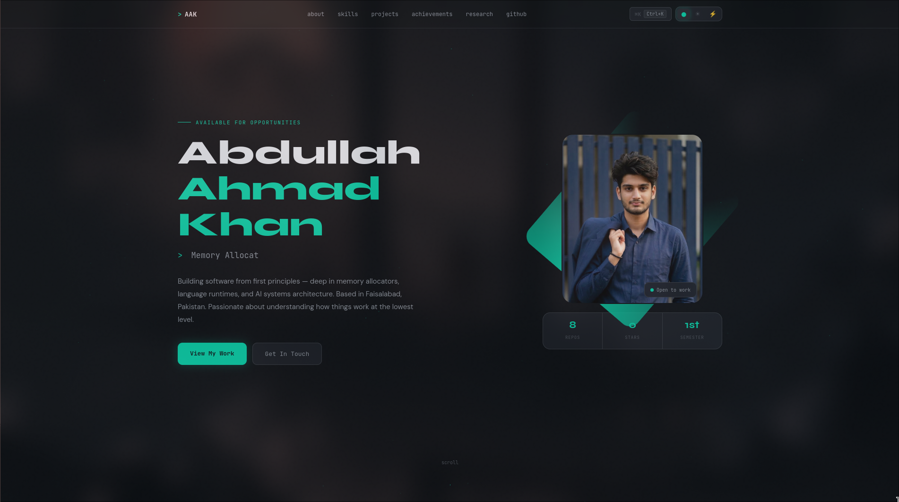

# Abdullah Ahmad Khan — Portfolio

[](https://za-coding-paradox.github.io/portfolio)
[](LICENSE)

> Personal portfolio for **Abdullah Ahmad Khan** — Systems Architect, Low-Level Developer, and AI Systems Builder based in Faisalabad, Pakistan.

---

## 📸 Preview



---

## ✨ Features

- **Three themes** — Dark, Light, and Terminal (Pywal-inspired)
- **Command Palette** — `Ctrl+K` / `⌘K` to navigate anywhere instantly
- **Live GitHub Dashboard** — Fetches real repos, stars, and recent activity via GitHub API
- **Animated star field** — Canvas-based starfield background
- **Typewriter effect** — Rotating role titles in the hero section
- **Scroll-reveal animations** — Sections fade in as you scroll
- **Responsive** — Fully mobile-friendly layout
- **Sections:** Hero · About · Skills · Projects · Achievements · Research · GitHub

---

## 🗂️ Project Structure

```
abdullah-portfolio/
├── index.html              # Main HTML entry point
├── assets/
│   ├── css/
│   │   └── style.css       # All styles (themes, layout, components)
│   ├── js/
│   │   └── main.js         # All JavaScript (GitHub API, animations, etc.)
│   └── images/
│       ├── profile.jpeg    # Profile photo
│       └── favicon.png     # Browser tab icon (add your own)
├── docs/
│   └── preview.png         # Screenshot for README (add your own)
├── .gitignore
├── LICENSE
└── README.md
```

---

## 🚀 Getting Started

### Run Locally

No build step required — it's pure HTML, CSS, and vanilla JS.

```bash
# Clone the repo
git clone https://github.com/Za-Coding-Paradox/portfolio.git
cd portfolio

# Open in browser
open index.html
# or with a local server (recommended to avoid CORS on GitHub API):
npx serve .
# or
python3 -m http.server 3000
```

### Deploy to GitHub Pages

1. Push this folder to a GitHub repository (e.g. `Za-Coding-Paradox/portfolio`)
2. Go to **Settings → Pages**
3. Set source to `main` branch, `/ (root)`
4. Your site will be live at `https://za-coding-paradox.github.io/portfolio`

---

## ⚙️ Customisation

### Update Personal Info

All personal content is in `index.html` — search for these to update:

| What | Where to look |
|---|---|
| Name / tagline | `#hero` section |
| About text | `#about` section |
| Skills | `#skills` section |
| Achievements | `#achievements` section |
| Research articles | `#research` section |
| Email / GitHub links | `#about` contact items + footer |
| GitHub username | `main.js` → `fetchGitHub()` function |

### Change Themes

Themes are defined as CSS custom properties in `style.css`:

```css
[data-theme="dark"]     { --bg: #080c10; --acc: #00d4aa; ... }
[data-theme="light"]    { --bg: #ffffff; --acc: #0d7a63; ... }
[data-theme="terminal"] { --bg: #020608; --acc: #00ffcc; ... }
```

### Profile Photo

Replace `assets/images/profile.jpeg` with your own photo. The frame expects a portrait-oriented image (roughly 3:4 ratio works best).

### GitHub Integration

The live dashboard calls `https://api.github.com/users/{username}` and related endpoints. Update the username in `main.js`:

```js
const GITHUB_USERNAME = 'Za-Coding-Paradox'; // ← change this
```

Unauthenticated requests are limited to **60 req/hour** by GitHub. For production, consider adding a token via a serverless function.

---

## 🛠️ Tech Stack

| Layer | Technology |
|---|---|
| Markup | HTML5 (semantic) |
| Styling | CSS3 (custom properties, grid, flexbox) |
| Scripting | Vanilla JavaScript (ES2020+) |
| Fonts | Google Fonts — JetBrains Mono, Syne, DM Sans |
| Data | GitHub REST API v3 |
| Hosting | GitHub Pages (recommended) |

No frameworks. No bundlers. No dependencies.

---

## 📄 License

This project is licensed under the **MIT License** — see [LICENSE](LICENSE) for details.

---

## 🤝 Contact

**Abdullah Ahmad Khan**
- 📧 [Abdullah.Ahmad.Khan.Professional@gmail.com](mailto:Abdullah.Ahmad.Khan.Professional@gmail.com)
- 💻 [github.com/Za-Coding-Paradox](https://github.com/Za-Coding-Paradox)
- 📍 Faisalabad, Punjab, Pakistan
